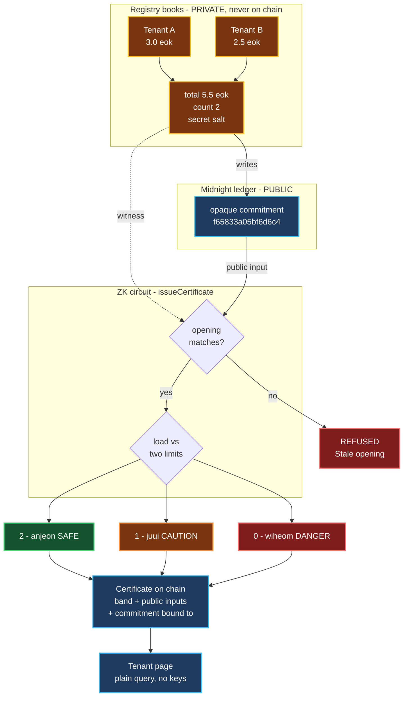
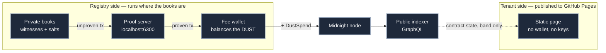

# Waterline · 워터라인 (woteorain)

**Prove a 전세 (jeonse) property isn't over-leveraged, without revealing anyone's deposit.**

> **전세 (jeonse)** — the dominant Korean lease form. Instead of monthly rent, the tenant hands the landlord a very large refundable lump-sum deposit, often 50–80% of the property's value, returned at the end of the lease. It is effectively an interest-free loan to the landlord, secured only by the property.

A ship loaded past its waterline is unsafe. So is a building carrying more lease deposits than its value can cover. Waterline computes that load against its limit inside a zero-knowledge circuit and discloses **one band — 안전 (anjeon, "safe"), 주의 (juui, "caution") or 위험 (wiheom, "danger") — and nothing else.**

Built on [Midnight](https://midnight.network) for the Midnight Korea Hackathon 2026.
**Judges: [`SUBMISSION.md`](SUBMISSION.md)** has the submitted answers, the fastest demo path, and the
one compiler flag that will break the build if it is skipped.

**▶ Live site: [mj-jinx.github.io/waterline](https://mj-jinx.github.io/waterline/)**
&nbsp;·&nbsp; **▶ Slide deck: [mj-jinx.github.io/waterline/deck.html](https://mj-jinx.github.io/waterline/deck.html)**

No wallet, no extension, no signup, no testnet tokens. Open the link.

| Page | What it shows |
|---|---|
| **[How it works](https://mj-jinx.github.io/waterline/guide.html)** | **start here** — a plain-language walkthrough for non-technical readers: what to click, what each screen means, what you can and cannot do, and an honest table of what is live versus illustrated |
| **[Run the full demo](https://mj-jinx.github.io/waterline/demo.html)** | **the whole lifecycle in one click** — a building registered, four real Plonk proofs computed **in your own browser**, the certificate that comes out, and a box where you can try to forge the total. Narrated at every step. First run downloads ~11 MB of prover keys |
| [Check a building](https://mj-jinx.github.io/waterline/check.html) | the tenant view — a verdict band read off the live ledger, with a downloadable QR certificate |
| [Why a landlord can’t lie](https://mj-jinx.github.io/waterline/why-lying-fails.html) | claim any total you like, and watch the certificate refuse to exist. **A scripted animation**, on a timer, touching no network — for the real circuit refusing, use the forge box on [the demo page](https://mj-jinx.github.io/waterline/demo.html) or run `npm run verify:refusal` locally |
| [Registry console](https://mj-jinx.github.io/waterline/registry.html) | the proving pipeline, framed as a simulation |
| [Slide deck](https://mj-jinx.github.io/waterline/deck.html) | twelve slides: problem, mechanism, privacy, business model, evidence. Press <kbd>P</kbd> to print to PDF |
| [Design system](https://mj-jinx.github.io/waterline/foundations.html) | palette, type scale, components, the figure in all three bands |

The demo buildings on those pages are fictional and labelled as such. The contract in the footer is
real: [`e99711c0…3ac2`](https://explorer.preprod.midnight.network/contracts/e99711c00fbcb7ee9a12f81a75e151367bf7899cbda96a1c54c75393494f3ac2)
on Midnight preprod.

---

## The problem

In a **다가구주택 (dagagu jutaek — a multi-household house under a single owner)** there is one owner and one **등기부 (deunggibu — the official property title register)** for the entire building. Individual units are *not* separately registered.

So a prospective tenant **cannot see how many other tenants already hold claims ranking ahead of theirs.** Those other deposits appear only in **확정일자 (hwakjeongilja — the official date-stamp on a lease that fixes a tenant's priority of repayment)** records held at the **주민센터 (jumin senteo — local government service centre)**, not in the property register.

That information asymmetry is the primary mechanism of **전세사기 (jeonse sagi — jeonse fraud)**.

| Measure | Figure |
|---|---|
| Recognised 전세사기 victims, cumulative to Aug 2026 | **40,936** cases [^1] |
| Debt carried by victims in the special restructuring scheme | **~₩400bn** across **3,898** people [^2] |
| Share of *those 3,898 restructuring users* in their 20s–30s | **89.2%** (3,478 people) [^2] |

> The 89.2% figure describes the 3,898 people who entered the **특례채무조정 (teungnye chaemu jojeong — special debt-restructuring scheme)**, not all 40,936 recognised victims. Age data for the full victim population is not published on the same basis.

### The statutory duty already exists — and that is the opening

This is the part most people miss. Korea **already legally requires** landlords to disclose exactly what Waterline proves.

**주택임대차보호법 (Housing Lease Protection Act) Article 3-7 — 임대인의 정보 제시 의무 (landlord's duty to present information)** [^3] obliges a landlord, at the point of signing, to present:

1. the property's 확정일자 date, rent and deposit information — *or*, alternatively, consent to a lookup under Article 3-6(4); and
2. tax-clearance certificates under **국세징수법 (National Tax Collection Act) Article 108** — *or*, alternatively, consent to an unpaid-tax inspection under **Article 109(1)** [^4].

The law was added precisely because tenants could not see the landlord's tax arrears or the **선순위 보증금 (seonsunwi bojeunggeum — senior deposits ranking ahead of yours)** [^5].

**Both routes to compliance force full disclosure.** Hand over the documents, or consent to the lookup — either way the landlord exposes tax arrears, credit standing, every other tenant's deposit, and total portfolio leverage. That is why landlords resist, and why resistance looks reasonable.

**Waterline is a third route to satisfying the same statutory duty, disclosing only a band.** That makes compliance cheap, which in turn makes **refusal a signal** rather than the default.

### Why the incumbent app doesn't close this

HUG's **안심전세앱 (Ansim Jeonse App — "peace-of-mind jeonse app", the official risk-check app from the Korea Housing & Urban Guarantee Corporation)** reached full rollout in September 2026 with risk grading and 선순위 보증금 comparison [^6]. Waterline is not a replacement for it, and does not pretend the problem is unaddressed. It attacks the one thing that architecture cannot fix:

**It avoids building the honeypot.** That approach pools data from **행정안전부 (Ministry of the Interior and Safety)**, **국세청 (National Tax Service)**, **한국부동산원 (Korea Real Estate Board)** and HUG into one place.

Korea's **개인정보 보호법 (PIPA — Personal Information Protection Act)** has restricted processing of the **주민등록번호 (jumin deungnok beonho — Resident Registration Number, Korea's national identifier)** since 2014 under Article 24-2, with fines of up to **3% of total revenue** under Article 64-2 [^7].

What changed *this month*: the **2026 PIPA amendment**, passed on 12 February 2026 and **in force from 11 September 2026**, raises the ceiling for repeated or serious violations to **10% of total sales**, requires notifying data subjects within **72 hours** of a suspected breach, and makes the CEO the final accountable party. It also extends the data-portability right beyond finance into healthcare, telecoms and retail [^8].

The net effect is that holding a large pooled store of Korean personal data became materially more expensive in the same month this project was built. PIPA restricts the join; zero-knowledge proofs let you compute the answer *without* the join.

### There is a court-priced business model

On **4 September 2026** the Seoul Central District Court raised **공인중개사 (gongin junggaesa — licensed real-estate broker)** liability in two jeonse-fraud damages suits to **60%** and **70%** [^9].

The 60% case is directly on point: a **다가구주택 in 관악구 (Gwanak-gu), Seoul**, deposit ₩180m, where the broker **misstated the building's value and the 선순위 임차보증금** — the exact fact this system proves. The appellate bench overturned the first-instance ruling and awarded ₩108m.

That is court-established, effectively uninsurable exposure to a single factual claim. A per-certificate proof that discharges a broker's 설명의무 (seolmyeong umu — duty to explain) has an obvious buyer.

*(The demo mirrors that case **profile** — a 다가구 (multi-household house) whose senior deposits exceed its appraisal limit — but deliberately names no district. Attaching a real location to a fabricated building on a public page would be wrong, and the fact that the court case happened in 관악구 is not something the demo should borrow. The live entry is labelled only by its commitment.)*

---

## The concept



Every write must **open the previous commitment** before it can replace it — the edge marked `writes`. That single rule is what makes the total unfalsifiable. `1 eok (억) = 100 million won ≈ USD 72k`.

### What crosses the boundary

| Fact | On chain? | Who learns it |
|---|---|---|
| Each tenant's individual deposit | **no** | registry only |
| Total senior deposits | **no** | registry only |
| Number of prior leases | **no** | registry only |
| Commitment salt | **no** | registry only |
| Opaque commitment per building | yes | anyone |
| Appraised value, both thresholds | yes | anyone — they are public inputs |
| **The band (안전 / 주의 / 위험)** | yes | anyone |
| Commitment the certificate was bound to | yes | anyone — this is the freshness check |

**Freshness without disclosure.** Each certificate records the commitment it was computed against. A reader compares it to the live commitment: if they differ, the books moved since issuance and the certificate is **stale**. That signals staleness without revealing the lease count or any amount.

---

## Why understatement is impossible, not merely detectable

A commitment alone would not be enough — the registry could pick any opening it liked. A Merkle membership proof would not be enough either: it proves *inclusion*, not *exhaustiveness*, so a dishonest registry would simply omit leases.

Waterline welds the entries together. `registerLease` can only write a new commitment if the prover can **open the previous one**:

```compact
assert(disclose(prevCommit == buildingState.lookup(bid)), "Stale opening");
```

The clearest analogy is the **medieval tally stick**. A debt was notched into a single stick, which was then split lengthwise — one half to each party. Neither half could be altered afterwards, because it had to still match the other. Waterline's commitment chain is the same trick: to understate the total today, the registry would have had to understate it at every prior step, and each tenant's own registration is already notched into the chain.

This is the **proof-of-liabilities** problem, familiar from exchange reserve audits, solved with a chained commitment.

---

## Verified, end to end, on preprod

Not simulated. Every step below ran against the live Midnight preprod network.

```text
contract  e99711c00fbcb7ee9a12f81a75e151367bf7899cbda96a1c54c75393494f3ac2

deploy                            proven + dust-sponsored   7041 -> 16305 B   landed
openBuilding                      proven + dust-sponsored   5086 -> 14356 B   landed
registerLease  tenant A  3.0 eok  proven + dust-sponsored   5168 -> 14432 B   landed
registerLease  tenant B  2.5 eok  proven + dust-sponsored   5168 -> 14432 B   landed
issueCertificate  x3 (see below)  proven + dust-sponsored   5126 -> 14390 B   landed

registry books (private):  total 5.5 eok across 2 leases
building commitment:       f65833a05bf6d6c47b18884d7e20674c90b7ddde...  (opaque)
```

> These rows are left as they ran. At the time the fee was sponsored by a third
> party, which is what `dust-sponsored` records; the write path has since moved
> to local proving and a self-funded DUST fee, for the reasons under
> [Architecture](#architecture-two-sides-and-only-one-of-them-is-published).
> Rewriting the log to match the current code would be claiming a run that never
> happened.

### The self-funded run — 2026-09-22

The rows above were sponsored by a third party. These were not. Proved on our own
proof server at `127.0.0.1:6300`, balanced against our own NIGHT registered for
DUST generation, signed and submitted straight to the node. Nothing on the path
but us and the chain.

```text
                                              submitted tx         size    landed commitment
openBuilding    proven locally + self-funded  0x3c18b4fc810c3207…  8336 B  c17a51bf96dc5032…
registerLease   proven locally + self-funded  0xdb6caa48e926a129…  8418 B  ea9cc5b4973c4a18…
registerLease   proven locally + self-funded  0x71c34a600aff2b46…  8418 B  7113061f936e4a5c…
```

Those three rows are **one** of the buildings, and the chain is visible in the
right-hand column: each write lands a new commitment, and the next write has to
open it. The last one, `7113061f…`, is the commitment the SAFE certificate below
is bound to.

Repeating that for two more buildings gave **three separate entries, each with its
own private books and its own band**, all on the same contract and all readable by
anyone:

| Live entry | Commitment (opaque) | Appraised | Band on chain |
|---|---|---|---|
| 1 | `f65833a05bf6d6c4…` | ₩6.0억 | 0 · ⚠️ **위험 wiheom DANGER** |
| 2 | `7113061f936e4a5c…` | ₩8.0억 | 2 · ✅ **안전 anjeon SAFE** |
| 3 | `19cd5b940ab6ad76…` | ₩7.0억 | 1 · △ **주의 juui CAUTION** |

Snapshotted at **block 2,661,364**, all three `fresh: true` — meaning each
certificate still names the commitment that is live on chain right now. The
figures behind them are three genuinely different sets of books; the ledger holds
a band and a commitment for each, and not one won of any deposit. Re-read them
yourself with `npm run read`, or look at
[`site/data/certificates.json`](site/data/certificates.json) for the snapshot the
site serves.

### The three verdicts

| Appraised | 안전 ≤ 70% | 주의 ≤ 80% | Total claimed | Band | Verdict |
|---|---|---|---|---|---|
| ₩9.0억 | ₩6.3억 | ₩7.2억 | ₩5.5억 *(true)* | 2 | ✅ **안전 anjeon — SAFE** |
| ₩7.0억 | ₩4.9억 | ₩5.6억 | ₩5.5억 *(true)* | 1 | △ **주의 juui — CAUTION** |
| ₩6.0억 | ₩4.2억 | ₩4.8억 | ₩5.5억 *(true)* | 0 | ⚠️ **위험 wiheom — DANGER** |
| ₩6.0억 | ₩4.2억 | ₩4.8억 | ₩3.0억 *(**a lie**)* | — | ❌ **REFUSED: `Stale opening`** |

All four rows were executed against live preprod. The three honest bands were each published on chain and read back through the public indexer.

**The last row is the point.** Same building, same ₩6.0억 appraisal as the row above it. Honestly, ₩5.5억 exceeds even the 주의 ceiling of ₩4.8억, so the building is **위험**. The landlord claims ₩3.0억 instead — which would fall under the ₩4.2억 안전 line and flip DANGER into SAFE. The circuit recomputes the commitment from the forged figure, finds it does not match what is already on chain, and refuses.

The three honest rows show the other half: identical private books, three different verdicts, and in every case the ledger records only a band. ₩5.5억 is never disclosed — not when the answer is safe, not when it is dangerous.

> **Where the refusal happens — stated precisely.** Case C fails at **circuit-execution time, on the landlord's own machine** — before a proof exists, before anything is submitted. There is no transaction for the chain to reject, because no satisfying witness exists. This is *stronger* than a chain-level rejection: the landlord cannot even produce a fraudulent certificate to show a tenant, which is the actual threat. But it would be wrong to describe it as "the chain rejected it," so we don't.

---

## Architecture: two sides, and only one of them is published

The asymmetry is the design. The side that **reads** is a static page with no wallet,
no keys and no proving. The side that **writes** holds the books, and needs both.



- **Reads** — the official public indexer, unauthenticated, CORS `*`. A visitor installs nothing, signs nothing and pays nothing, because reading a verdict is a GraphQL query.
- **ZK keys** — 11 MB for three circuits, needed only by the side that *proves*. **The tenant-facing page needs none of it:** `issueCertificate` publishes the band to the ledger, so `/check` has no WASM and no key downloads. That is why it can load instantly.
- **Proving** — a local proof server. The **prover key travels with the request** via `createProvingPayload`, so a prover can prove a contract it has never seen; that is what makes a *remote* prover technically possible, and also exactly why this one is not remote. See the trust boundary below.
- **Fees** — the registry pays its own way: hold NIGHT, register it for DUST generation, balance locally, submit. Balancing happens **after** proving, appending a `DustSpend` to an already-proven transaction rather than being part of what gets proved.

> **The trust boundary, stated precisely.** A proving request carries the proof
> preimage. For this contract the witnesses include the registry secret key, the
> deposit total, the lease count and the salt — every value the project exists to
> protect. Sending that to a third-party prover would leak precisely the thing
> being protected. That is tolerable for a testnet demo over invented buildings
> and intolerable for anything real, so the default is local. `PROVER` overrides it.
>
> **Where the demo page sits in this.** It does not break the boundary, it
> relocates it. The tab plays the **registry**, not the tenant: it generates a
> throwaway secret key, invents its own books, and proves against those. Nothing
> private leaves the tab, because nothing in the tab belongs to anyone. That is
> also its honest limit — it proves the circuits work and the refusal is real, and
> it cannot prove anything *about a real building*, because it holds no real
> registry's books.
>
> An earlier version proved and sponsored fees through [1AM ProofStation](https://api.1am.xyz/docs),
> which is elegant — one call, no wallet, no DUST — but it put a third party on the
> critical path of every write. On 2026-09-22 its preprod balancer returned `503`
> for hours while preview and mainnet were healthy, and nothing could be written
> for as long as it was down.

---

## Reproducing

Requires Node ≥ 20 and the Compact CLI. **There is no Windows build of the Compact CLI** — use WSL, macOS or Linux.

```bash
# 1. Compile. Use +0.31.1 — it emits runtime 0.16.0, which is what the
#    stable midnight-js 4.1.1 line pins. Newer compilers emit runtime
#    0.19.0 and fail at load with a version-mismatch error.
compact compile +0.31.1 contracts/waterline.compact build/waterline

npm install

# 2. Registry side — deploy, open a building, register two leases (writes)
node src/registry.mjs

# 3. Issue a verdict certificate. Try each appraisal to see all three bands:
node src/certify.mjs 9          # -> 2  안전 anjeon  SAFE
node src/certify.mjs 7          # -> 1  주의 juui    CAUTION
node src/certify.mjs 6          # -> 0  위험 wiheom  DANGER

# 4. Try to cheat: understate the total to win a better band
node src/certify.mjs 6 --attack # -> REFUSED: Stale opening

# 5. Tenant side — the read path the web UI uses. No wallet, no proving,
#    no prover keys, no transaction. Two ledger lookups.
node src/read.mjs

# 6. Build the in-browser demo, then open site/demo.html and press the button.
#    Proves all four circuits client-side. Needs step 1 to have run.
npm run build:demo
```

State persists to `state.json`: the registry secret key, the contract address and the per-building salts. **Do not lose it.** `registryPk` is sealed at construction, so without the secret key a deployed contract is permanently unwritable.

### The site

`site/` is the deployed front end — plain HTML, CSS and JS with no build step, no framework and no
dependencies beyond a Google Fonts link. One page breaks that rule on purpose: `demo.html` loads a
bundle, because it proves. It is published to GitHub Pages by
[`.github/workflows/pages.yml`](.github/workflows/pages.yml) on every push to `main`, uploaded
verbatim.

```bash
cd site && python3 -m http.server 8080   # or just open site/index.html
```

**The tenant pages host no ZK prover keys and load no proving machinery.** `issueCertificate` writes
the verdict band to the ledger, so `/check` is a read rather than a proof — no WASM, no keys, no
wallet, which is why it loads instantly. A test asserts it stays that way.

`demo.html` is the deliberate exception, and it is opt-in: nothing downloads until you press the
button. It ships the ~11 MB of prover keys and two WASM modules because it really proves, in the tab.
Both are build output, neither is committed, and a test asserts that too — see
[Run the full demo](#run-the-full-demo-in-the-visitors-own-browser).

`site/deck.html` is the slide deck — the same tokens and typeface as the rest of the site, twelve slides, arrow keys to move and <kbd>P</kbd> to print to PDF. `site/assets/qr.js` is a dependency-free QR encoder: a page that tells you whether a building is safe should not also tell a CDN which building you asked about.

`design/` holds the specification behind it: [`BUILD-SPEC.md`](design/BUILD-SPEC.md), the design
tokens, and the original canvas artboards. The one rule worth repeating here — **the water surface is
drawn as a hatched band, never a level.** The page genuinely does not know the total, so a precise
surface would be either a lie or a disclosure.

### Run the full demo, in the visitor's own browser

[**demo.html**](https://mj-jinx.github.io/waterline/demo.html) is the one page that computes real
proofs client-side. Press *Run Full Demo* and it invents a building, opens it, registers two deposits
and issues the certificate — **four real Plonk proofs, in the tab, about 10–20 s each** — narrating
what just happened and what comes next at every step. Then a box lets you type a total the registry
might wish were true, and watch the contract refuse it.

Nothing is downloaded until you press the button, and nothing is submitted to the chain. See
[the trust boundary](#architecture-two-sides-and-only-one-of-them-is-published) for why:

- **Proving in the browser is real.** The tab plays the *registry*, over books it invents on the spot,
  with a key it generates and throws away. That is the only honest framing: to issue a certificate you
  must **open the current commitment**, which takes the deposit total, the lease count and the salt —
  the private books. **A tenant can never prove**, and the demo does not pretend otherwise.
- **Submitting from the browser is not.** Paying the DUST fee needs the fee wallet's private key, and
  publishing that key in a public repo is not something we will do. So the demo stops at a valid proof
  and a certificate document, and links to the three buildings that *are* on chain.

Building it needs the compiled contract, because the worker runs the same circuits the registry does:

```bash
npm run compile
npm run build:demo     # Vite bundle -> site/assets/demo/, keys -> site/zk/
```

`build:demo` bundles [`demo-src/`](demo-src/) with Vite — needed only because the runtime and zkir
packages use WebAssembly ESM integration, which esbuild cannot load — then stages the prover keys and
zkir into `site/zk/`. **Neither is committed.** Prover keys are 11 MB of build output, and judging
starts with cloning the repository; nobody should wait on that. GitHub Actions rebuilds both at deploy
time, non-fatally, so a bundle failure costs one page rather than the whole site.

The Plonk SRS in [`site/params/`](site/params/) **is** committed, deliberately — its upstream S3
bucket timed out on us mid-build, and a demo that depends on someone else's bucket being up is a demo
that fails in front of a judge.

```bash
node test/browser-demo.mjs                 # against ./site, from a local server
BASE=https://mj-jinx.github.io/waterline node test/browser-demo.mjs
```

That is the only test that means anything for this page: every other test here can pass while the demo
is a frozen tab, because the proving lives in a Web Worker and the worker only exists in a browser. It
clicks the button, waits out four proofs, and asserts the band is `safe` and the forged total is
refused. Not part of `npm test` — it needs Chromium and spends a minute proving.

**The `BASE` form is the one that matters before a deadline**, because it asks the question a judge
will: does the *deployed* site prove? The bundle and the keys are built in CI and never committed, so
a local pass says nothing about whether the deploy staged them.

It has already earned its keep. The local run was clean while the deployed site showed
`Downloading proving keys — 0 KB of 0 KB (120%)` and reported nothing at all for the two multi-megabyte
files. GitHub Pages gzips them: it sends no `content-length` for the big ones, so the streaming branch
never ran, and a *compressed* length for the small ones, which decompressed bytes then overshot. A local
server sets an exact length and does not compress, so neither could ever have shown up locally.

### Testing

```bash
npm test              # everything (52 tests)
npm run test:site     # front end + QR only; needs no toolchain, runs in ~0.1s
npm run test:contract # circuits; needs a compiled contract
npm run verify:refusal # just the attack: watch the real circuit refuse to lie
```

### Watch the refusal happen, rather than watching an animation

The [Why a landlord can’t lie](https://mj-jinx.github.io/waterline/why-lying-fails.html) page is a
scripted illustration. It runs on a timer, touches no network, and uses a fabricated building — it is
labelled as a simulated landlord device top and bottom.

To watch the **real** circuit refuse, there are now two ways. In a browser, use the forge box on
[the demo page](https://mj-jinx.github.io/waterline/demo.html): type a total the registry did not
commit to, and the contract throws `failed assert: Stale opening` in your own tab, before any proof
exists. Or locally, in one command:

```bash
npm install
compact compile +0.31.1 contracts/waterline.compact build/waterline
npm run verify:refusal
```

That runs a single test against the compiled circuit, in-process through `compact-runtime`. It
builds a building with two leases totalling ₩5.5억, confirms the honest verdict against a ₩6.0억
appraisal is **위험 DANGER**, then forges an opening claiming ₩3.0억 — the lie that would flip it to
안전 SAFE — and asserts the circuit throws. The assertion matches on `/Stale opening/`, the exact
string the web page displays, so the words on the animation and the words from the circuit are the
same words.

A passing test is a weak signal on its own, so check that it can fail. In that test, change the
forged opening `{ total: 3n * EOK, count: 1n }` to the true books, `{ total: 55n * EOK / 10n,
count: 2n }`. It now fails with `Missing expected exception`, because a correct opening does not
throw.

Changing only the total to the true ₩5.5억 and leaving `count: 1n` still throws. The commitment is
taken over the total **and** the lease count **and** the salt, so getting one of the three right is
not enough. That is the chain doing its job: a landlord who knows the total but not the salt, or who
miscounts the leases, cannot open it either.

No test framework and no dependencies — `node:test` against a local simulator. The contract suite runs circuits in-process through `compact-runtime`, so a failed assert surfaces exactly as it does on a prover's machine.

It pins the band boundaries at the cap (`load <= cap` is 안전, one won over is not), proves 선순위 liens count against the building, proves a forged opening cannot be executed, and asserts the privacy claim directly: **two buildings with different books that land in the same band produce certificates identical except for the opaque commitment.**

The suite can fail — mutating `load <= safeCap` to `<` in the contract and recompiling fails exactly one test, the boundary test, and no others.

The front-end suite is one test per defect that actually shipped: a pipeline that could never finish, chips that ignored `min-height` because they were inline, and result views that rendered stacked because an inline `display` outranks the UA `[hidden]` rule. It also guards that no ZK key material is *committed* (via `git ls-files`, so a local build cannot mask it), that the tenant pages load no proving machinery, that every DOM hook exists, and that the water surface is never a line.

Two of those tests exist because of a mistake made building the demo. The link checker started failing in CI and passing locally — `demo.html` references `assets/demo/demo.js`, which is gitignored build output, present in a working tree and absent in a fresh clone. Exempting generated paths fixes it and quietly opens a hole: any broken link under an exempt prefix would now pass. So a second test asserts each exempt prefix really is gitignored *and* really is produced by the build. Verified by moving the build output aside and running the suite both ways — 52 either way.

[CI](.github/workflows/ci.yml) runs both on every push. A clean clone compiles in **about 19s** on a
GitHub-hosted runner, and the full suite runs in well under a second after that.

### Gotchas worth knowing

| Symptom | Cause |
|---|---|
| `Version mismatch: compiled code expects 0.19.0` | Compiled with 0.34.0. Use `+0.31.1`. |
| `expected instance of LedgerParameters` | Two copies of `ledger-v8` — two WASM instances. Pin `8.1.0`. |
| `403 Forbidden` submitting a transaction | HTTPS RPC caps bodies well under 20 KB. Use `wss://`. |
| `1010: Custom error: 182` | Intent TTL expired. Prove and submit in the same process, no gap. |
| `type error: argument 3` | A `Uint<8>` circuit arg needs a BigInt (`70n`, not `70`). |
| `reading 'Symbol()'` inside compact-js | `CompiledContract` combinators called curried. Use the data-first form. |
| `npm ci` fails with `Missing: smoldot … from lock file` | npm 11 prunes optional peer deps that npm 10 records. CI pins npm 10.8.2 and the lockfile matches it, so on npm 11 use `npm install`, which reports removing two packages and leaves the lockfile modified. Do not commit that. |

---

## Honest limitations

- **Trust is reduced, not eliminated.** It reduces to "the registry inserts leases correctly" — the same trust already placed in the 주민센터. What you gain: no cross-agency data pooling, cheap statutory compliance, tamper-evidence, and a portable proof. Compare the current unpaid-tax inspection, where the documented procedure lets a tenant *view* a landlord's arrears at the tax office but **not print or photograph them** [^10] — a purely procedural privacy control, replaced here by a mathematical one.
- **The registry here is simulated.** A demo console stands in for the 주민센터. The ZK layer is real and runs on-chain; the issuer is not. Wiring a real government registry is not a hackathon deliverable and we do not pretend otherwise.
- **Thresholds are parameters, not legal advice.** The 70% figure is illustrative only. It is *not* a statutory ratio, and must not be confused with the separate deposit-guarantee ratios applying to registered rental businesses.
- **Prior art exists.** Blockchain approaches to jeonse fraud have been proposed academically. We found no shipped implementation. The contribution here is the chained-commitment construction plus a working wallet-free deployment.

---

## Sources

[^1]: 국토교통부 전세사기피해지원위원회 — cumulative recognised victims, 40,936 cases as of August 2026. Reported [세계일보, 2026-09-13](https://www.segye.com/newsView/20260913509454).
[^2]: 한국주택금융공사 (HF) 특례채무조정 — 3,898 users June 2023 to July 2026; ~₩400bn debt; 30s 2,023 (51.9%) + 20s 1,455 (37.3%) = 3,478 (89.2%). [파이낸셜뉴스, 2026-09-13](https://www.fnnews.com/news/202609131357198351); [서울파이낸스](https://www.seoulfn.com/news/articleView.html?idxno=637824).
[^3]: 주택임대차보호법 제3조의7 (임대인의 정보 제시 의무) — [국가법령정보센터](https://www.law.go.kr/LSW/lsInfoP.do?lsId=001248) · [CaseNote](https://casenote.kr/%EB%B2%95%EB%A0%B9/%EC%A3%BC%ED%83%9D%EC%9E%84%EB%8C%80%EC%B0%A8%EB%B3%B4%ED%98%B8%EB%B2%95/%EC%A0%9C3%EC%A1%B0%EC%9D%987).
[^4]: 국세징수법 제108조 (납세증명서) and 제109조 (미납국세 등 열람). Deposits above ₩10m may be inspected without landlord consent after signing, up to the lease start date.
[^5]: 법무부 press release, 2026-03-30 — legislative rationale for the Article 3-7 amendment: tenants could not learn the landlord's tax arrears or senior deposit information. [moj.go.kr](https://www.moj.go.kr/bbs/moj/182/451959/download.do) · [정책브리핑](https://www.korea.kr/news/policyNewsView.do?newsId=148913348).
[^6]: HUG 안심전세앱 — integrated risk information and grading service, full rollout from September 2026, built with 한국부동산원. Reported [코리아스프린트](https://www.koreasprint.com/news/articleView.html?idxno=18817) · [천지일보](https://www.newscj.com/news/articleView.html?idxno=3424659).
[^7]: 개인정보 보호법 제24조의2 (주민등록번호 처리의 제한), added by 법률 제11990호 (promulgated 2013-08-06, **in force 2014-08-07** — not 2026), and 제64조의2 (과징금의 부과): processing an RRN in breach of Article 24-2 carries a fine of up to **3% of total revenue (전체 매출액)**, or up to ₩2bn where revenue cannot be determined. [국가법령정보센터](https://www.law.go.kr/lsEfInfoP.do?lsiSeq=195062) · [제24조의2](https://casenote.kr/%EB%B2%95%EB%A0%B9/%EA%B0%9C%EC%9D%B8%EC%A0%95%EB%B3%B4_%EB%B3%B4%ED%98%B8%EB%B2%95/%EC%A0%9C24%EC%A1%B0%EC%9D%982) · [제64조의2](https://casenote.kr/%EB%B2%95%EB%A0%B9/%EA%B0%9C%EC%9D%B8%EC%A0%95%EB%B3%B4_%EB%B3%B4%ED%98%B8%EB%B2%95/%EC%A0%9C64%EC%A1%B0%EC%9D%982).
[^8]: 2026 PIPA amendment — passed the National Assembly plenary on 2026-02-12, **in force 2026-09-11**: penalties for repeated or serious violations up to **10% of total sales**; 72-hour breach notification; CEO as final accountable party; CPO appointment by board resolution; data portability extended to healthcare, telecoms and retail (ISMS-P certification obligations phase in from 2027-07-01). [법률신문 — 개정안 통과](https://www.lawtimes.co.kr/news/articleView.html?idxno=217245) · [법률신문 — 9월 11일 시행](https://www.lawtimes.co.kr/news/articleView.html?idxno=226491).
[^9]: 서울중앙지법, reported 2026-09-04 — broker liability set at 60% (Gwanak-gu 다가구주택, ₩180m deposit, misstated building value and senior lease deposits; ₩108m awarded on appeal) and 70% (forged trust-company consent; ₩84m). [법률신문](https://www.lawtimes.co.kr/news/articleView.html?idxno=225874) · [머니투데이](https://www.mt.co.kr/society/2026/09/04/2026090411110374844).
[^10]: 미납국세 열람 procedure — arrears may be viewed in person but not printed or photographed. [대한민국 정책브리핑](https://www.korea.kr/news/reporterView.do?newsId=148916704).

> Statutory references were checked against 국가법령정보센터 (the Korean government legal information service). News-reported figures are attributed to the outlet that reported them. Nothing here is legal advice.

---

## Credits

- Built on [Midnight](https://midnight.network), Compact compiler 0.31.1
- [1AM ProofStation](https://api.1am.xyz/docs) proved and sponsored every write on this project until 2026-09-22, which is what let it get to a working demo with no wallet and no funds at all. It is no longer on the write path — see the trust boundary under [Architecture](#architecture-two-sides-and-only-one-of-them-is-published) — but it is the reason there was something to move off.
- Extrinsic encoding via [@polkadot/api](https://github.com/polkadot-js/api)
- Thanks to [ODATANO](https://github.com/ODATANO) — the Apache-2.0 [NIGHTGATE](https://github.com/ODATANO/NIGHTGATE) examples documented that a Midnight ledger transaction must be wrapped in `midnight.sendMnTransaction`, which unblocked submission here. Its [`self-funded.mjs`](https://github.com/ODATANO/NIGHTGATE/blob/main/packages/nightgate-tx/example/self-funded.mjs) then documented the whole sponsor-free path — prove locally, pay the DUST fee from your own wallet, submit to the node yourself — which is what [`src/fee-wallet.mjs`](src/fee-wallet.mjs) is built on. Twice unblocked by the same repository.

## License

Apache-2.0. See [LICENSE](LICENSE).
