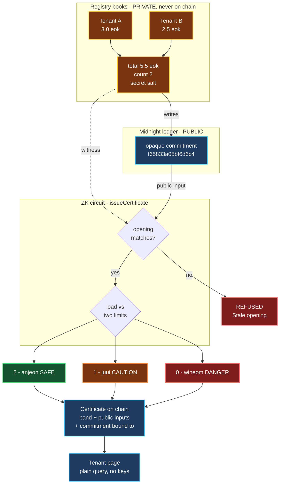
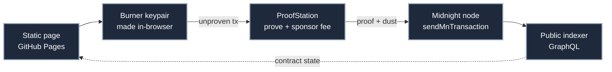

# Waterline · 워터라인 (woteorain)

**Prove a 전세 (jeonse) property isn't over-leveraged, without revealing anyone's deposit.**

> **전세 (jeonse)** — the dominant Korean lease form. Instead of monthly rent, the tenant hands the landlord a very large refundable lump-sum deposit, often 50–80% of the property's value, returned at the end of the lease. It is effectively an interest-free loan to the landlord, secured only by the property.

A ship loaded past its waterline is unsafe. So is a building carrying more lease deposits than its value can cover. Waterline computes that load against its limit inside a zero-knowledge circuit and discloses **one band — 안전 (anjeon, "safe"), 주의 (juui, "caution") or 위험 (wiheom, "danger") — and nothing else.**

Built on [Midnight](https://midnight.network) for the Midnight Korea Hackathon 2026.

---

## The problem

In a **다가구주택 (dagagu jutaek — a multi-household house under a single owner)** there is one owner and one **등기부 (deunggibu — the official property title register)** for the entire building. Individual units are *not* separately registered.

So a prospective tenant **cannot see how many other tenants already hold claims ranking ahead of theirs.** Those other deposits appear only in **확정일자 (hwakjeongilja — the official date-stamp on a lease that fixes a tenant's priority of repayment)** records held at the **주민센터 (jumin senteo — local government service centre)**, not in the property register.

That information asymmetry is the primary mechanism of **전세사기 (jeonse sagi — jeonse fraud)**.

| Measure | Figure |
|---|---|
| Recognised 전세사기 victims, cumulative to Aug 2026 | **40,936** cases [^1] |
| Debt carried by victims in the special restructuring scheme | **~₩400bn** across **3,898** people [^2] |
| Share of *those 3,898 restructuring users* in their 20s–30s | **89.2%** (3,478 people) [^2] |

> The 89.2% figure describes the 3,898 people who entered the **특례채무조정 (teungnye chaemu jojeong — special debt-restructuring scheme)**, not all 40,936 recognised victims. Age data for the full victim population is not published on the same basis.

### The statutory duty already exists — and that is the opening

This is the part most people miss. Korea **already legally requires** landlords to disclose exactly what Waterline proves.

**주택임대차보호법 (Housing Lease Protection Act) Article 3-7 — 임대인의 정보 제시 의무 (landlord's duty to present information)** [^3] obliges a landlord, at the point of signing, to present:

1. the property's 확정일자 date, rent and deposit information — *or*, alternatively, consent to a lookup under Article 3-6(4); and
2. tax-clearance certificates under **국세징수법 (National Tax Collection Act) Article 108** — *or*, alternatively, consent to an unpaid-tax inspection under **Article 109(1)** [^4].

The law was added precisely because tenants could not see the landlord's tax arrears or the **선순위 보증금 (seonsunwi bojeunggeum — senior deposits ranking ahead of yours)** [^5].

**Both routes to compliance force full disclosure.** Hand over the documents, or consent to the lookup — either way the landlord exposes tax arrears, credit standing, every other tenant's deposit, and total portfolio leverage. That is why landlords resist, and why resistance looks reasonable.

**Waterline is a third route to satisfying the same statutory duty, disclosing only a band.** That makes compliance cheap, which in turn makes **refusal a signal** rather than the default.

### Why the incumbent app doesn't close this

HUG's **안심전세앱 (Ansim Jeonse App — "peace-of-mind jeonse app", the official risk-check app from the Korea Housing & Urban Guarantee Corporation)** reached full rollout in September 2026 with risk grading and 선순위 보증금 comparison [^6]. Waterline is not a replacement for it, and does not pretend the problem is unaddressed. It attacks the one thing that architecture cannot fix:

**It avoids building the honeypot.** That approach pools data from **행정안전부 (Ministry of the Interior and Safety)**, **국세청 (National Tax Service)**, **한국부동산원 (Korea Real Estate Board)** and HUG into one place.

Korea's **개인정보 보호법 (PIPA — Personal Information Protection Act)** has restricted processing of the **주민등록번호 (jumin deungnok beonho — Resident Registration Number, Korea's national identifier)** since 2014 under Article 24-2, with fines of up to **3% of total revenue** under Article 64-2 [^7].

What changed *this month*: the **2026 PIPA amendment**, passed on 12 February 2026 and **in force from 11 September 2026**, raises the ceiling for repeated or serious violations to **10% of total sales**, requires notifying data subjects within **72 hours** of a suspected breach, and makes the CEO the final accountable party. It also extends the data-portability right beyond finance into healthcare, telecoms and retail [^8].

The net effect is that holding a large pooled store of Korean personal data became materially more expensive in the same month this project was built. PIPA restricts the join; zero-knowledge proofs let you compute the answer *without* the join.

### There is a court-priced business model

On **4 September 2026** the Seoul Central District Court raised **공인중개사 (gongin junggaesa — licensed real-estate broker)** liability in two jeonse-fraud damages suits to **60%** and **70%** [^9].

The 60% case is directly on point: a **다가구주택 in 관악구 (Gwanak-gu), Seoul**, deposit ₩180m, where the broker **misstated the building's value and the 선순위 임차보증금** — the exact fact this system proves. The appellate bench overturned the first-instance ruling and awarded ₩108m.

That is court-established, effectively uninsurable exposure to a single factual claim. A per-certificate proof that discharges a broker's 설명의무 (seolmyeong umu — duty to explain) has an obvious buyer.

*(The demo below deliberately uses a 관악구 다가구 building to mirror that case profile.)*

---

## The concept



Every write must **open the previous commitment** before it can replace it — the edge marked `writes`. That single rule is what makes the total unfalsifiable. `1 eok (억) = 100 million won ≈ USD 72k`.

### What crosses the boundary

| Fact | On chain? | Who learns it |
|---|---|---|
| Each tenant's individual deposit | **no** | registry only |
| Total senior deposits | **no** | registry only |
| Number of prior leases | **no** | registry only |
| Commitment salt | **no** | registry only |
| Opaque commitment per building | yes | anyone |
| Appraised value, both thresholds | yes | anyone — they are public inputs |
| **The band (안전 / 주의 / 위험)** | yes | anyone |
| Commitment the certificate was bound to | yes | anyone — this is the freshness check |

**Freshness without disclosure.** Each certificate records the commitment it was computed against. A reader compares it to the live commitment: if they differ, the books moved since issuance and the certificate is **stale**. That signals staleness without revealing the lease count or any amount.

---

## Why understatement is impossible, not merely detectable

A commitment alone would not be enough — the registry could pick any opening it liked. A Merkle membership proof would not be enough either: it proves *inclusion*, not *exhaustiveness*, so a dishonest registry would simply omit leases.

Waterline welds the entries together. `registerLease` can only write a new commitment if the prover can **open the previous one**:

```compact
assert(disclose(prevCommit == buildingState.lookup(bid)), "Stale opening");
```

The clearest analogy is the **medieval tally stick**. A debt was notched into a single stick, which was then split lengthwise — one half to each party. Neither half could be altered afterwards, because it had to still match the other. Waterline's commitment chain is the same trick: to understate the total today, the registry would have had to understate it at every prior step, and each tenant's own registration is already notched into the chain.

This is the **proof-of-liabilities** problem, familiar from exchange reserve audits, solved with a chained commitment.

---

## Verified, end to end, on preprod

Not simulated. Every step below ran against the live Midnight preprod network.

```text
contract  e99711c00fbcb7ee9a12f81a75e151367bf7899cbda96a1c54c75393494f3ac2

deploy                            proven + dust-sponsored   7041 -> 16305 B   landed
openBuilding                      proven + dust-sponsored   5086 -> 14356 B   landed
registerLease  tenant A  3.0 eok  proven + dust-sponsored   5168 -> 14432 B   landed
registerLease  tenant B  2.5 eok  proven + dust-sponsored   5168 -> 14432 B   landed
issueCertificate  x3 (see below)  proven + dust-sponsored   5126 -> 14390 B   landed

registry books (private):  total 5.5 eok across 2 leases
building commitment:       f65833a05bf6d6c47b18884d7e20674c90b7ddde...  (opaque)
```

### The three verdicts

| Appraised | 안전 ≤ 70% | 주의 ≤ 80% | Total claimed | Band | Verdict |
|---|---|---|---|---|---|
| ₩9.0억 | ₩6.3억 | ₩7.2억 | ₩5.5억 *(true)* | 2 | ✅ **안전 anjeon — SAFE** |
| ₩7.0억 | ₩4.9억 | ₩5.6억 | ₩5.5억 *(true)* | 1 | △ **주의 juui — CAUTION** |
| ₩6.0억 | ₩4.2억 | ₩4.8억 | ₩5.5억 *(true)* | 0 | ⚠️ **위험 wiheom — DANGER** |
| ₩6.0억 | ₩4.2억 | ₩4.8억 | ₩3.0억 *(**a lie**)* | — | ❌ **REFUSED: `Stale opening`** |

All four rows were executed against live preprod. The three honest bands were each published on chain and read back through the public indexer.

**The last row is the point.** Same building, same ₩6.0억 appraisal as the row above it. Honestly, ₩5.5억 exceeds even the 주의 ceiling of ₩4.8억, so the building is **위험**. The landlord claims ₩3.0억 instead — which would fall under the ₩4.2억 안전 line and flip DANGER into SAFE. The circuit recomputes the commitment from the forged figure, finds it does not match what is already on chain, and refuses.

The three honest rows show the other half: identical private books, three different verdicts, and in every case the ledger records only a band. ₩5.5억 is never disclosed — not when the answer is safe, not when it is dangerous.

> **Where the refusal happens — stated precisely.** Case C fails at **circuit-execution time, on the landlord's own machine** — before a proof exists, before anything is submitted. There is no transaction for the chain to reject, because no satisfying witness exists. This is *stronger* than a chain-level rejection: the landlord cannot even produce a fraudulent certificate to show a tenant, which is the actual threat. But it would be wrong to describe it as "the chain rejected it," so we don't.

---

## Architecture: no wallet, no fees, no server

The demo runs from GitHub Pages. A visitor installs nothing, signs nothing and pays nothing.



- **Identity** — a throwaway keypair from `generateRandomSeed()`. No extension, no seed phrase shown, no user action.
- **Proving** — ProofStation proves the circuit. The **prover key travels with the request** via `createProvingPayload`, which is why a third-party prover can prove a contract it has never seen before.
- **Fees** — the same service adds a `DustSpend`, so the user pays nothing.
- **Reads** — the official public indexer, unauthenticated, CORS `*`.
- **ZK keys** — 11 MB for three circuits, needed only by the side that *proves*. **The tenant-facing page needs none of it:** `issueCertificate` publishes the band to the ledger, so `/check` is a plain GraphQL query with no WASM and no key downloads. That is why it can load instantly.

> ProofStation is third-party infrastructure, not official Midnight infra, and it rate-limits to one pending balance request at a time. Keep a "connect wallet" fallback for production. In-process WASM proving is a viable independent alternative.

---

## Reproducing

Requires Node ≥ 20 and the Compact CLI. **There is no Windows build of the Compact CLI** — use WSL, macOS or Linux.

```bash
# 1. Compile. Use +0.31.1 — it emits runtime 0.16.0, which is what the
#    stable midnight-js 4.1.1 line pins. Newer compilers emit runtime
#    0.19.0 and fail at load with a version-mismatch error.
compact compile +0.31.1 contracts/waterline.compact build/waterline

npm install

# 2. Registry side — deploy, open a building, register two leases (writes)
node src/registry.mjs

# 3. Issue a verdict certificate. Try each appraisal to see all three bands:
node src/certify.mjs 9          # -> 2  안전 anjeon  SAFE
node src/certify.mjs 7          # -> 1  주의 juui    CAUTION
node src/certify.mjs 6          # -> 0  위험 wiheom  DANGER

# 4. Try to cheat: understate the total to win a better band
node src/certify.mjs 6 --attack # -> REFUSED: Stale opening

# 5. Tenant side — the read path the web UI uses. No wallet, no proving,
#    no prover keys, no transaction. Two ledger lookups.
node src/read.mjs
```

State persists to `state.json`: the registry secret key, the contract address and the per-building salts. **Do not lose it.** `registryPk` is sealed at construction, so without the secret key a deployed contract is permanently unwritable.

### Gotchas worth knowing

| Symptom | Cause |
|---|---|
| `Version mismatch: compiled code expects 0.19.0` | Compiled with 0.34.0. Use `+0.31.1`. |
| `expected instance of LedgerParameters` | Two copies of `ledger-v8` — two WASM instances. Pin `8.1.0`. |
| `403 Forbidden` submitting a transaction | HTTPS RPC caps bodies well under 20 KB. Use `wss://`. |
| `1010: Custom error: 182` | Intent TTL expired. Prove and submit in the same process, no gap. |
| `type error: argument 3` | A `Uint<8>` circuit arg needs a BigInt (`70n`, not `70`). |
| `reading 'Symbol()'` inside compact-js | `CompiledContract` combinators called curried. Use the data-first form. |

---

## Honest limitations

- **Trust is reduced, not eliminated.** It reduces to "the registry inserts leases correctly" — the same trust already placed in the 주민센터. What you gain: no cross-agency data pooling, cheap statutory compliance, tamper-evidence, and a portable proof. Compare the current unpaid-tax inspection, where the documented procedure lets a tenant *view* a landlord's arrears at the tax office but **not print or photograph them** [^10] — a purely procedural privacy control, replaced here by a mathematical one.
- **The registry here is simulated.** A demo console stands in for the 주민센터. The ZK layer is real and runs on-chain; the issuer is not. Wiring a real government registry is not a hackathon deliverable and we do not pretend otherwise.
- **Thresholds are parameters, not legal advice.** The 70% figure is illustrative only. It is *not* a statutory ratio, and must not be confused with the separate deposit-guarantee ratios applying to registered rental businesses.
- **Prior art exists.** Blockchain approaches to jeonse fraud have been proposed academically. We found no shipped implementation. The contribution here is the chained-commitment construction plus a working wallet-free deployment.

---

## Sources

[^1]: 국토교통부 전세사기피해지원위원회 — cumulative recognised victims, 40,936 cases as of August 2026. Reported [세계일보, 2026-09-13](https://www.segye.com/newsView/20260913509454).
[^2]: 한국주택금융공사 (HF) 특례채무조정 — 3,898 users June 2023 to July 2026; ~₩400bn debt; 30s 2,023 (51.9%) + 20s 1,455 (37.3%) = 3,478 (89.2%). [파이낸셜뉴스, 2026-09-13](https://www.fnnews.com/news/202609131357198351); [서울파이낸스](https://www.seoulfn.com/news/articleView.html?idxno=637824).
[^3]: 주택임대차보호법 제3조의7 (임대인의 정보 제시 의무) — [국가법령정보센터](https://www.law.go.kr/LSW/lsInfoP.do?lsId=001248) · [CaseNote](https://casenote.kr/%EB%B2%95%EB%A0%B9/%EC%A3%BC%ED%83%9D%EC%9E%84%EB%8C%80%EC%B0%A8%EB%B3%B4%ED%98%B8%EB%B2%95/%EC%A0%9C3%EC%A1%B0%EC%9D%987).
[^4]: 국세징수법 제108조 (납세증명서) and 제109조 (미납국세 등 열람). Deposits above ₩10m may be inspected without landlord consent after signing, up to the lease start date.
[^5]: 법무부 press release, 2026-03-30 — legislative rationale for the Article 3-7 amendment: tenants could not learn the landlord's tax arrears or senior deposit information. [moj.go.kr](https://www.moj.go.kr/bbs/moj/182/451959/download.do) · [정책브리핑](https://www.korea.kr/news/policyNewsView.do?newsId=148913348).
[^6]: HUG 안심전세앱 — integrated risk information and grading service, full rollout from September 2026, built with 한국부동산원. Reported [코리아스프린트](https://www.koreasprint.com/news/articleView.html?idxno=18817) · [천지일보](https://www.newscj.com/news/articleView.html?idxno=3424659).
[^7]: 개인정보 보호법 제24조의2 (주민등록번호 처리의 제한), added by 법률 제11990호 (promulgated 2013-08-06, **in force 2014-08-07** — not 2026), and 제64조의2 (과징금의 부과): processing an RRN in breach of Article 24-2 carries a fine of up to **3% of total revenue (전체 매출액)**, or up to ₩2bn where revenue cannot be determined. [국가법령정보센터](https://www.law.go.kr/lsEfInfoP.do?lsiSeq=195062) · [제24조의2](https://casenote.kr/%EB%B2%95%EB%A0%B9/%EA%B0%9C%EC%9D%B8%EC%A0%95%EB%B3%B4_%EB%B3%B4%ED%98%B8%EB%B2%95/%EC%A0%9C24%EC%A1%B0%EC%9D%982) · [제64조의2](https://casenote.kr/%EB%B2%95%EB%A0%B9/%EA%B0%9C%EC%9D%B8%EC%A0%95%EB%B3%B4_%EB%B3%B4%ED%98%B8%EB%B2%95/%EC%A0%9C64%EC%A1%B0%EC%9D%982).
[^8]: 2026 PIPA amendment — passed the National Assembly plenary on 2026-02-12, **in force 2026-09-11**: penalties for repeated or serious violations up to **10% of total sales**; 72-hour breach notification; CEO as final accountable party; CPO appointment by board resolution; data portability extended to healthcare, telecoms and retail (ISMS-P certification obligations phase in from 2027-07-01). [법률신문 — 개정안 통과](https://www.lawtimes.co.kr/news/articleView.html?idxno=217245) · [법률신문 — 9월 11일 시행](https://www.lawtimes.co.kr/news/articleView.html?idxno=226491).
[^9]: 서울중앙지법, reported 2026-09-04 — broker liability set at 60% (Gwanak-gu 다가구주택, ₩180m deposit, misstated building value and senior lease deposits; ₩108m awarded on appeal) and 70% (forged trust-company consent; ₩84m). [법률신문](https://www.lawtimes.co.kr/news/articleView.html?idxno=225874) · [머니투데이](https://www.mt.co.kr/society/2026/09/04/2026090411110374844).
[^10]: 미납국세 열람 procedure — arrears may be viewed in person but not printed or photographed. [대한민국 정책브리핑](https://www.korea.kr/news/reporterView.do?newsId=148916704).

> Statutory references were checked against 국가법령정보센터 (the Korean government legal information service). News-reported figures are attributed to the outlet that reported them. Nothing here is legal advice.

---

## Credits

- Built on [Midnight](https://midnight.network), Compact compiler 0.31.1
- Sponsored proving by [1AM ProofStation](https://api.1am.xyz/docs)
- Extrinsic encoding via [@polkadot/api](https://github.com/polkadot-js/api)
- Thanks to [ODATANO](https://github.com/ODATANO) — the Apache-2.0 [NIGHTGATE](https://github.com/ODATANO/NIGHTGATE) examples documented that a Midnight ledger transaction must be wrapped in `midnight.sendMnTransaction`, which unblocked submission here.

## License

Apache-2.0. See [LICENSE](LICENSE).
