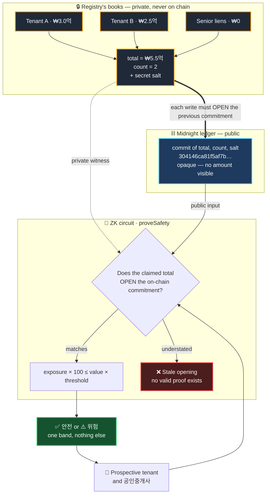
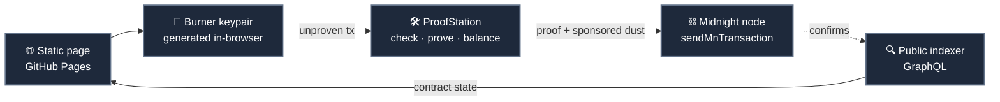

# Waterline · 워터라인

**Prove a 전세 property isn't over-leveraged, without revealing anyone's deposit.**

A ship loaded past its waterline is unsafe. So is a building carrying more lease deposits than its value can cover. Waterline computes that load against its limit inside a zero-knowledge circuit and discloses **one band — 안전 or 위험 — and nothing else.**

Built on [Midnight](https://midnight.network) for the Midnight Korea Hackathon 2026.

---

## The problem

In a **다가구주택** there is one owner and one 등기부 for the entire building. Individual units are not separately registered. So a prospective tenant **cannot see how many other tenants already hold prior claims on the same property** — the other deposits sit in 확정일자 records at the 주민센터, not in the property register.

That information asymmetry is the primary mechanism of 전세사기.

| | |
|---|---|
| Recognised 전세사기 victims (to end-Aug 2026) | **40,936** |
| Victims aged 20s–30s | **89.2%** |
| Debt under special restructuring | **~₩400bn** across ~3,900 people |

### Why this isn't already solved

HUG's **안심전세앱** reached full rollout in September 2026 with risk grading and 선순위 보증금 comparison. Waterline is not a replacement for it. It attacks the two things that architecture cannot fix.

**1. The consent deadlock.** 안심전세앱 still requires **임대인 동의** to show arrears and credit information. Landlords refuse, and refusing is *reasonable* — consent today exposes their entire financial position: tax arrears, credit standing, every other tenant's deposit, total portfolio leverage. A ZK proof discloses a single band instead. That makes consent cheap to grant, which in turn makes **refusal a signal** rather than the default.

**2. It avoids building the honeypot.** The incumbent approach pools 행안부 + 국세청 + 한국부동산원 + HUG data into one place. Under the **PIPA amendments effective 2026-08-07** — RRN redaction, fines up to 10% of annual revenue for large-scale violations — that concentration is now a liability rather than an asset. PIPA forbids the join; zero-knowledge proofs enable the computation *without* the join.

There is also a working business model. On **2026-09-04** Korean courts held 공인중개사 liable for **60–70%** of deposit losses — and the 60% case was specifically for **misstating 선순위 임차보증금**, the exact fact this system proves. That is court-priced, currently uninsurable exposure to a single factual claim.

---

## The concept



### What crosses the boundary

| Fact | On chain? | Who learns it |
|---|---|---|
| Each tenant's individual deposit | **no** | registry only |
| Total senior deposits | **no** | registry only |
| Number of prior leases | **no** | registry only |
| Commitment salt | **no** | registry only |
| Opaque commitment per building | yes | anyone |
| Appraised value, threshold % | yes | anyone — they are public inputs |
| **안전 / 위험 verdict** | yes | anyone |

---

## Why understatement is impossible, not merely detectable

A commitment alone would not be enough — the registry could pick any opening it liked. A Merkle membership proof would not be enough either: it proves *inclusion*, not *exhaustiveness*, so a dishonest registry would simply omit leases.

Waterline welds the entries together. `registerLease` can only write a new commitment if the prover can **open the previous one**:

```compact
assert(disclose(prevCommit == buildingState.lookup(bid)), "Stale opening");
```

The clearest way to explain this is the **medieval tally stick**. A debt was notched into a single stick, which was then split lengthwise — one half to each party. Neither half could be altered afterwards, because it had to still match the other. Waterline's commitment chain is the same trick: to understate the total today, the registry would have had to understate it at every prior step, and each tenant's own registration is already notched into the chain.

This is the **proof-of-liabilities** problem, familiar from exchange reserve audits, solved with a chained commitment.

---

## Verified, end to end, on preprod

Not simulated. Every step below ran against the live Midnight preprod network.

```text
contract  0af6cf55a2d8a24ac954f0a60b91cd7da210c78d241accfa2ed552ed2b8b6067

openBuilding                     proven + dust-sponsored   5086 → 14350 B   landed
registerLease  tenant A ₩3.0억   proven + dust-sponsored   5168 → 14432 B   landed
registerLease  tenant B ₩2.5억   proven + dust-sponsored   5168 → 14431 B   landed

registry books (private):  total ₩5.5억 across 2 leases
visible on chain:          304146ca81f5af7bbdd4efd373ad956f…  (opaque)
```

### The three verdicts

| Case | Appraised | Cap @ 70% | Total claimed | Result |
|---|---|---|---|---|
| **A** honest | ₩9.0억 | ₩6.3억 | ₩5.5억 *(true)* | ✅ **안전** — ZK proof, 4,964 B |
| **B** honest | ₩7.0억 | ₩4.9억 | ₩5.5억 *(true)* | ⚠️ **위험** — ZK proof, 4,964 B |
| **C** attack | ₩7.0억 | ₩4.9억 | ₩3.0억 *(**lie**)* | ❌ **refused: `Stale opening`** |

**Case C is the point.** Identical building and appraisal to B. The landlord understates the total specifically to flip 위험 into 안전 and get the lease signed. The circuit recomputes the commitment from the forged figure, finds it does not match what is already on chain, and refuses.

Cases A and B together show the other half: identical private state, opposite verdicts, and in **both** cases the chain learns only `true` or `false`. ₩5.5억 is never disclosed — not when the answer is safe, not when it is unsafe.

> **Where the refusal happens — stated precisely.** Case C fails at **circuit-execution time, on the landlord's own machine** — before a proof exists, before anything is submitted. There is no transaction for the chain to reject, because no satisfying witness exists. This is *stronger* than a chain-level rejection: the landlord cannot even produce a fraudulent certificate to show a tenant, which is the actual threat. But it would be wrong to describe it as "the chain rejected it," so we don't.

---

## Architecture: no wallet, no fees, no server

The demo runs from GitHub Pages. A visitor installs nothing, signs nothing and pays nothing.



- **Identity** — a throwaway keypair from `generateRandomSeed()`. No extension, no seed phrase shown, no user action.
- **Proving** — ProofStation proves the circuit. The **prover key travels with the request** via `createProvingPayload`, which is why a third-party prover can prove a contract it has never seen before.
- **Fees** — the same service adds a `DustSpend`, so the user pays nothing.
- **Reads** — the official public indexer, unauthenticated, CORS `*`.
- **ZK keys** — 11 MB for three circuits, served straight from this repo. Well inside GitHub Pages' limits.

> ProofStation is third-party infrastructure, not official Midnight infra, and it rate-limits to one pending balance request at a time. Keep a "connect wallet" fallback for production. In-process WASM proving is a viable independent alternative.

---

## Reproducing

Requires Node ≥ 20 and the Compact CLI. **There is no Windows build of the Compact CLI** — use WSL, macOS or Linux.

```bash
# 1. Compile. Use +0.31.1 — it emits runtime 0.16.0, which is what the
#    stable midnight-js 4.1.1 line pins. Newer compilers emit runtime
#    0.19.0 and fail at load with a version-mismatch error.
compact compile +0.31.1 contracts/waterline.compact build/waterline

npm install

# 2. Registry side — open a building, register two leases (writes to chain)
node src/registry.mjs

# 3. Tenant side — the two honest verdicts, then the attack
node src/verify.mjs
```

State persists to `state.json`: the registry secret key, the contract address and the per-building salts. **Do not lose it.** `registryPk` is sealed at construction, so without the secret key a deployed contract is permanently unwritable.

### Gotchas worth knowing

| Symptom | Cause |
|---|---|
| `Version mismatch: compiled code expects 0.19.0` | Compiled with 0.34.0. Use `+0.31.1`. |
| `expected instance of LedgerParameters` | Two copies of `ledger-v8` — two WASM instances. Pin `8.1.0`. |
| `403 Forbidden` submitting a transaction | HTTPS RPC caps bodies well under 20 KB. Use `wss://`. |
| `1010: Custom error: 182` | Intent TTL expired. Prove and submit in the same process, no gap. |
| `type error: argument 3` | A `Uint<8>` circuit arg needs a BigInt (`70n`, not `70`). |

---

## Honest limitations

- **Trust is reduced, not eliminated.** It reduces to "the registry inserts leases correctly" — the same trust already placed in 주민센터. What you gain: no cross-agency data pooling, cheap consent, tamper-evidence, and a portable proof instead of the current 미납국세 rule, under which a tenant may *look at* a landlord's tax arrears but **may not print or photograph them**.
- **The registry here is simulated.** A demo console stands in for 주민센터. The ZK layer is real and runs on-chain; the issuer is not. Wiring a real government registry is not a hackathon deliverable and we do not pretend otherwise.
- **Thresholds are parameters, not legal advice.** The 70% figure is illustrative. Do not conflate it with the July 2026 changes to registered-rental-business deposit guarantee ratios.
- **Prior art exists.** Blockchain approaches to jeonse fraud have been proposed academically, including a 2026 Springer chapter. We found no shipped implementation. The contribution here is the chained-commitment construction plus a working wallet-free deployment.

---

## Credits

- Built on [Midnight](https://midnight.network), Compact compiler 0.31.1
- Sponsored proving by [1AM ProofStation](https://api.1am.xyz/docs)
- Extrinsic encoding via [@polkadot/api](https://github.com/polkadot-js/api)
- Thanks to [ODATANO](https://github.com/ODATANO) — the Apache-2.0 [NIGHTGATE](https://github.com/ODATANO/NIGHTGATE) examples documented that a Midnight ledger transaction must be wrapped in `midnight.sendMnTransaction`, which unblocked submission here.

## License

Apache-2.0. See [LICENSE](LICENSE).
